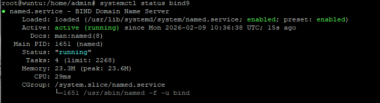

# 01-DNS-Server-Bind9

- OBJETIVO Y FUNCIONAMIENTO
    
    ## ¿Para qué sirve este Laboratorio?
    
    En el mundo real, los ordenadores no se comunican mediante nombres como "google.com", sino mediante números (IPs). El ser humano, sin embargo, recuerda mejor los nombres.
    
    **La utilidad de este laboratorio es:**
    
    - **Independencia de Red:** Crear un sistema de nombres propio que no dependa de proveedores externos .
    - **Privacidad y Velocidad:** Las consultas de nombres se resuelven dentro de tu propia red, lo que es más rápido y nadie desde fuera sabe a qué servicios internos accedes.
    - **Simulación de Entornos Corporativos:** Es la base para montar servicios más complejos como un Active Directory o una Intranet.
    
    ---
    
    ## ¿Qué hace exactamente mi configuración?
    
    Mi servidor BIND9 está actuando como un **Servidor DNS Maestro Autoritativo**. Esto significa que:
    
    1. **Gestiona la Zona Directa (`uwuntu.lan`):** Es el bibliotecario que guarda la ficha de quién es cada nombre. Cuando alguien pregunta por `www.uwuntu.lan`, él busca en su base de datos y entrega la IP `192.168.56.10`.
    2. **Gestiona la Zona Inversa:** Realiza la función de "matrícula". Si conoces la IP, el servidor te dice el nombre asociado.
    3. **Puente de Comunicación:** Gracias a la configuración de red híbrida, permite que una máquina Windows y una Linux se entiendan por nombre en un entorno aislado y seguro.
    
    ---
    
    ## Casos de Uso
    
    ### A. Hosting Web y Desarrollo
    
    Un desarrollador web puede crear nombres como `test.proyecto.local` o `cliente1.dev`. Así puede trabajar en múltiples webs en el mismo servidor sin tener que recordar diferentes IPs o usar el archivo *hosts* de Windows cada vez.
    
    ### B. Servidor de Archivos o Multimedia (NAS)
    
    En una casa o pequeña oficina, podrías llamar a tu servidor de películas o documentos simplemente `nube.local` o `archivos.lan`. Es mucho más fácil decirle a un compañero "conéctate a `archivos.lan`" que darle una IP difícil de recordar.
    
    ### C. Seguridad y Bloqueo (Sinkholing)
    
    Podrías configurar este servidor para que, si alguien intenta acceder a una web maliciosa tu DNS responda con una IP falsa o una página de advertencia, protegiendo a todos los usuarios de la red.
    

# 1. Instalación de BIND9

Ahora sí, abre la terminal de tu Ubuntu Server y ejecuta estos comandos. **Recuerda sacar captura de la terminal cuando el servicio esté "active".**

Bash

`1. Actualizar repositorios
sudo apt update

2. Instalar el paquete BIND9 y utilidades de red
sudo apt install bind9 bind9utils bind9-doc dnsutils -y

3. Verificar que el servicio está corriendo
sudo systemctl status bind9`

- EXPLICACION LINEAS
    - **`Active: active (running)`**: Indica que el proceso `named` (el daemon de BIND) está cargado en memoria y funcionando.
    - **`Main PID`**: Es el identificador único del proceso en el sistema.
    - **`Status: running`**: Confirma que el servidor está listo para recibir peticiones en el puerto 53

# 2. Definir la zona del servidor

Hay que indicarle a bind que va a ser el jefe del dominio en mi caso uwuntu.lan

1. Abre el archivo de zonas locales:
`sudo nano /etc/bind/named.conf.local`
2. Pega esto al final del archivo

`zone "uwuntu.lan" {
    type master;
    file "/etc/bind/db.uwuntu.lan";
};`

1. Guarda (**Ctrl+O**, Enter) y sal (**Ctrl+X**).

# 3. Crear la Base de Datos de Nombres

Ahora crearemos el archivo donde anotaremos qué nombre corresponde a cada IP. Usaremos una plantilla para no escribir todo desde cero.

1. Copia la plantilla:
`sudo cp /etc/bind/db.local /etc/bind/db.uwuntu.lan`
2. Abre el nuevo archivo:
`sudo nano /etc/bind/db.uwuntu.lan`

# 4. Editar los Registros

Borra el contenido y déjalo exactamente así

---

 Es MUY.. MUY IMPORTANTE respetar el punto final en nombres como `ns1.uwuntu.lan.`. Si se olvida, el servidor fallará porque pensará que el nombre es incompleto.

- EXPLICACION LINEAS
    - **`SOA` (Start of Authority)**: Es el "DNI" de la zona. Contiene el nombre del servidor principal y el correo del administrador.
    - **`NS` (Name Server)**: Identifica qué servidor es el encargado de responder por este dominio.
    - **`A` (Address)**: Es el registro estrella. Vincula el nombre `www` directamente con la IP `192.168.56.10`.

# 5. Verificar que no hay errores

Antes de reiniciar, vamos a preguntarle a Ubuntu si lo que hemos escrito tiene sentido:

1. Para comprobar la configuración general:
`sudo named-checkconf`
2. En nuestro caso queremos comprobar la zona específica:
`sudo named-checkzone uwuntu.lan /etc/bind/db.uwuntu.lan`

- EXPLICACION LINEAS
    
    **`loaded serial 2026020901`**: El "serial" es la versión de tu base de datos. Si lo cambias, otros servidores sabrán que hay datos nuevos.
    
    **`OK`**: Es el validador sintáctico. Indica que no hay errores de puntuación
    

1. **Como la respuesta que recibimos es  "OK", ya podemos reiniciar el servicio:**`sudo systemctl restart bind9`

# 6. Crear la Zona Inversa

hasta ahora lo que tenemos configurado el DNS sabe decir que IP tiene un nombre pero no que nombre tiene una IP.

**1. Declarar la zona en el archivo local**
Abre el archivo:
`nano /etc/bind/named.conf.local`

1. Añade 

- EXPLICACION
    
    ### 1. La línea de zona: `zone "56.168.192.in-addr.arpa" {`
    
    - Define el nombre de la zona inversa.
    - En el sistema DNS, las zonas inversas utilizan el dominio especial `.in-addr.arpa`. Las IPs se escriben al revés porque la jerarquía DNS va de lo general a lo específico. Aquí le estás diciendo al servidor: *"Tú eres el encargado de gestionar cualquier consulta que venga de la red 192.168.56.x"*.
    
    ### 2. El tipo: `type master;`
    
    - Indica que este servidor es el **Maestro** (o primario) de esta zona.
    - Significa que este servidor posee la copia original de los datos y tiene autoridad total para responder. No es un servidor esclavo que copia los datos de otro. él es la fuente de la verdad.
    
    ### 3. El archivo: `file "/etc/bind/db.192";`
    
    - Indica la ruta física del archivo que contiene los registros reales (los registros **PTR**).
    - Es el enlace que une esta declaración con el archivo que creaste usando la plantilla `db.127`. Cuando alguien pregunte por una IP, BIND9 leerá este archivo específico para buscar la respuesta.
    
    ---
    

**2. Creamos el archivo de los datos inversos** 
`cp /etc/bind/db.127 /etc/bind/db.192`

**2. Añadimos lo siguiente** 

(El 10 de abajo es el ultimo numero de la ip en mi caso la .10)

- EXPLICACION LINEAS
    - **`PTR` (Pointer)**: Explica que es el opuesto al registro 'A'. Aquí la clave es el número `10` (el último octeto de la IP), que apunta de vuelta al nombre del servidor.

1. Por ultimo comprobamos y reiniciamos el servicio

## RESULTADOS Y COMPROBACION

Probamos Nombre a IP, usamos Dig para preguntar al propio servidor y debemos buscar la seccion ANSWER SECTION, que debe aparecer nuestro servidor apuntando a la IP correcta

- EXPLICACION
    
    Cuando ejecutas `dig @127.0.0.1 www.uwuntu.lan`, la respuesta se divide en secciones.
    
    ### 1. Header
    
    `;; ->>HEADER<<- opcode: QUERY, status: NOERROR, id: 12345
    ;; flags: qr aa rd ra; QUERY: 1, ANSWER: 1, AUTHORITY: 1, ADDITIONAL: 1`
    
    - **status: NOERROR**: ¡Fundamental! Significa que el servidor encontró lo que buscabas. Si pusiera `NXDOMAIN`, es que el nombre no existe.
    - **flags: aa**: Significa **Authoritative Answer**. Esto es "Nivel Pro": le dice al mundo que tu servidor es el "dueño" de esa zona, no está inventando la respuesta ni sacándola de una caché de otro.
    
    ### 2. QUESTION SECTION
    
    `;www.uwuntu.lan.                IN      A`
    
    - Aquí simplemente repite lo que le has preguntado: "¿Qué IP (A) tiene `www.uwuntu.lan`?".
    
    ### 3. ANSWER SECTION
    
    `www.uwuntu.lan.         604800  IN      A       192.168.56.10`
    
    Esta es la parte más importante:
    
    - **604800**: Es el **TTL** (Time To Live). Le dice al cliente: "Puedes guardar esta respuesta en tu memoria durante una semana antes de volver a preguntarme".
    - **IN**: Clase de red (Internet).
    - **A**: Tipo de registro (Dirección IPv4).
    - **192.168.56.10**: El dato final que buscábamos.
    
    ### 4. ESTADISTICAS
    
    `;; Query time: 0 msec
    ;; SERVER: 127.0.0.1#53(127.0.0.1)`
    
    - **Query time**: Si sale **0 msec**, es porque la respuesta es local y ultra rápida.
    - **SERVER**: Confirma que te ha respondido tu propio BIND9 (`127.0.0.1` por el puerto `53`).
    
    ---
    

Resolucion Inversa de IP a nombre 

Comprobamos si el db.192 que creamos funciona y despues buscamos **ANSWER SECTION"**, debería decir que la IP apunta a `www.uwuntu.lan.` o `ns1.uwuntu.lan.`. el -x significa que haga una busqueda inversa, la unica diferencia es que en la respuesta no aparecera un registro tipo A, si no un PTR (explicacion de cada linea en el desplegable de arriba)

Para comprobar todo esto, accedemos a nuestra CMD y escribimos lo siguiente

nslookup www.uwuntu.lan 192.168.56.10. Esto se utiliza para preguntar a la maquina virtual por este nombre exacto 

- EXPLICACION
    - **`Servidor: UnKnown`**: Explica que aparece así porque Windows no tiene ese servidor en su lista de contactos de confianza, pero aun así lo consulta.
    - **`Respuesta no autoritativa`**: si aparece significa que la respuesta viene de un servidor que no es el principal de internet, sino de tu laboratorio local.
    - **`Address: 192.168.56.10`**: Es la confirmación final de que el "traductor" (DNS) ha hecho su trabajo correctamente.